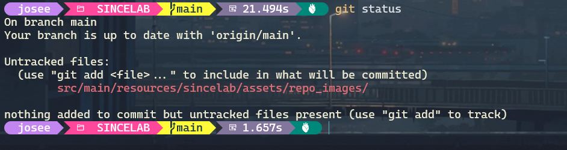
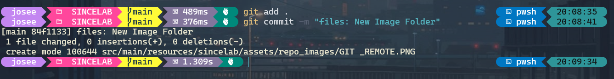
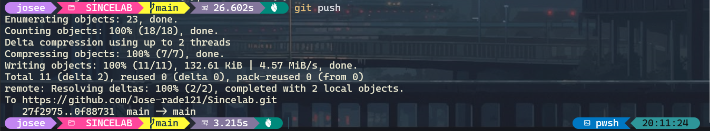

<h1 style = "font-size: 16 px; font-family = Courier New, Consolas, Monaco;" >SINCELAB</h1> 


## Inicializar el repositorio

Para inicializar el repositorio es **necesario** [instalar](https://git-scm.com/book/es/v2/Inicio---Sobre-el-Control-de-Versiones-Instalaci%C3%B3n-de-Git) `Git`;
al finalizar debe abrir la terminar o bash y asignar:

```bash
git --version
```

Si el proceso no da errores, la descarga fue correcta.
Luego de esto, se debe hacer el registro y configuracion de la `cuenta` de GitHub:

```bash
git config --global user.name "Tu Nombre"
git config --global user.email "tu-correo@ejemplo.com"
git config --global init.defaultBranch main
```
Al terminar el registro de la cuenta, traeremos el repositorio a nuestro dispositivo en el lugar donde queramos guardarlo:

```bash
git clone https://github.com/Jose-rade121/Sincelab.git
```

Ingresamos al proyecto con:
```bash
cd sincelab
```
Comprobamos que todo quedo bien:
```bash
git remote -v
```


En caso de que el comando `remote` no muestre nada escribiremos:
```bash
git remote add origin URL
```
Si muestra una `URL` Equivocada:
```bash
git remote set-url origin URL
```


## Añadir cambios al proyecto

### Terminal:

```bash
git status  #Que nuevos cambios hay
```


---

```bash
git add .   #Prepara los cambios
```

```bash
git commit -m "Descripcion de los cambios"
```


---

```bash
git push    #Envia a GitHub
```


---

```bash
git pull    #Trae los nuevos cambios
```


#### Flujo de trabajo:
```bash
git pull    #Trae los nuevos cambios
git status  #Que nuevos cambios hay
git add .   #Prepara los cambios
git commit -m "Descripcion de los cambios"
git push    #Envia a GitHub
```

>[!WARNING]
>Hacer el pull es de vital importancia, si no se hace y se fuerza el envio de la informacion esto podria borrar Archivos importantes.


## Estructura del proyecto

<!-- TREE:START -->
```text
Sincelab/
├── src/
│   └── main/
│       ├── java/
│       │   └── sincelab/
│       │       ├── storage/
│       │       │   ├── Archive.java
│       │       │   └── Users.java
│       │       ├── view/
│       │       │   ├── AboutWindow.java
│       │       │   ├── Header.java
│       │       │   ├── MainWindow.java
│       │       │   ├── PrincipalFont.java
│       │       │   ├── Themed.java
│       │       │   ├── Themes.java
│       │       │   └── UiLogin.java
│       │       └── Main.java
│       └── resources/
│           └── sincelab/
│               └── assets/
│                   ├── fonts/
│                   │   ├── Bestime.otf
│                   │   ├── Bestime.ttf
│                   │   ├── Hey_Comic.otf
│                   │   └── Hey_Comic.ttf
│                   ├── icons/
│                   │   ├── astronaunt-icon.png
│                   │   ├── guardado.png
│                   │   ├── icon.png
│                   │   ├── moon_black.png
│                   │   └── moon_white.png
│                   └── repo_images/
│                       ├── GIT _REMOTE.PNG
│                       ├── GIT_ADD_COMMIT.PNG
│                       ├── GIT_PULL.PNG
│                       ├── GIT_PUSH.PNG
│                       └── GIT_STATUS.PNG
├── .gitignore
├── nb-configuration.xml
├── pom.xml
└── README.md
```
<!-- TREE:END -->


### Descripcion de las clases

<h3>Carpeta java</h3>

* Main --> Archivo Principal de la aplicación; en este llama a la ventana principal y a los elementos de storage.

<h3>Carpeta Ui</h3>

* AboutWindow --> Ventana de la informacion de la aplicacion.

* Header --> Encabezado de la aplicacion.

* MainWindow --> Ventana principal, la que se abre al principio.

* PrincipalFont --> Carga las fuentes de letras.

* Themed --> Permite el cambio entre ventanas.

* Themes --> Modos de visualizacion claro y oscuro

<h3><strong>Carpeta Storage</strong></h3>

* FolderCreate --> Crea la carpeta donde se almacenan la informacion.

* Users --> Informacion de los usuarios.


 
